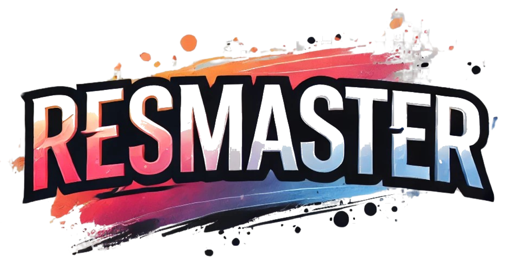
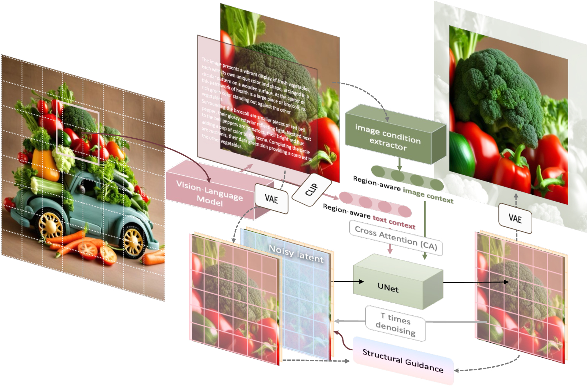

<!-- # ResMaster -->

<div align="center">
  
</div>

### <div align="center">🚀 ResMaster: Mastering High-Resolution Image Generation via Structural and Fine-Grained Guidance</div> 


<p align="center">
  <a href="https://scholar.google.com/citations?user=2ZAstoQAAAAJ&hl=en">Shuwei Shi</a><sup>1</sup>,
  <a href="https://fenglinglwb.github.io/">Wenbo Li</a><sup>2</sup>, 
  <a href="https://julianjuaner.github.io/">Yuechen Zhang</a><sup>2</sup>, 
  <a href="https://github.com/hejingwenhejingwen">Jingwen He</a><sup>2</sup>, 
  <a href="https://scholar.google.com/citations?user=BwdpTiQAAAAJ&hl=zh-CN&oi=ao" target="_blank">Biao Gong</a><sup>3</sup>, 
  <a href="https://scholar.google.com/citations?user=JD-5DKcAAAAJ&hl=zh-CN&oi=ao">Yinqiang Zheng‡</a><sup>1</sup>
  <br><br>
  <sup>1</sup>The University of Tokyo<br>
  <sup>2</sup>The Chinese University of Hong Kong<br>
  <sup>3</sup>Ant Group<br>
  <sup>‡</sup><a href="mailto:yqzheng@ai.u-tokyo.ac.jp">Corresponding author</a></span>
</p>


<br>

<div align="center">
  <a href="https://shuweis.github.io/ResMaster/"></a> &ensp;
  <a href="https://arxiv.org/abs/2406.16476"></a> &ensp;

</div>

<div align="center">
  </img>
  <br>
</div>
<br>


## 🎏 Abstract
Diffusion models excel at producing high-quality images; however, scaling to higher resolutions, such as 4K, often results in over-smoothed content, structural distortions, and repetitive patterns. To this end, we introduce ResMaster, a novel, training-free method that empowers resolution-limited diffusion models to generate high-quality images beyond resolution restrictions. Specifically, ResMaster leverages a low-resolution reference image created by a pre-trained diffusion model to provide structural and fine-grained guidance for crafting high-resolution images on a patch-by-patch basis. To ensure a coherent global structure,ResMaster meticulously aligns the low-frequency components of high-resolution patches with the low-resolution reference at each denoising step. For fine-grained guidance, tailored image prompts based on the low-resolution reference and enriched textual prompts produced by a vision-language model are incorporated. This approach could significantly mitigate local pattern distortions and improve detail refinement. Extensive experiments validate that ResMaster sets a new benchmark for high-resolution image generation and demonstrates promising efficiency.
## 💻 Overview
<div align="center">
  </img>
  <br>
</div>
<br>

ResMaster employs Structural and Fine-Grained Guidance to ensure structural integrity and enhance detail generation. Specifically, ResMaster implements low-frequency component swapping using the low-resolution image generated at each sampling step to maintain global structural coherence in higher-resolution outputs. Additionally, to mitigate repetitive patterns and increase detail accuracy, we employ localized fine-grained guidance using condensed image prompts and enriched textual descriptions. The image prompts, derived from the generated low-resolution counterparts, contain critical semantic and structural information. Simultaneously, the detailed textual prompts produced by a pre-trained visionlanguage model (VLM) contribute to image generation on more complex and accurate patterns.

## 🌰 More Examples
<div align="center">
  </img>
  <br>
</div>
<br>

## 🔥 Update

- 2024.6.25 - 🛳️ This repo is released.

## 🎓 Citation

```
@misc{shi2024resmaster,
  title={ResMaster: Mastering High-Resolution Image Generation via Structural and Fine-Grained Guidance},
  author={Shuwei Shi, Wenbo Li, Yuechen Zhang, Jingwen He, Biao Gong, Yinqiang Zheng},
  year={2024},
  eprint={2406.16476},
  archivePrefix={arXiv},
  primaryClass={cs.CV}
}
```
